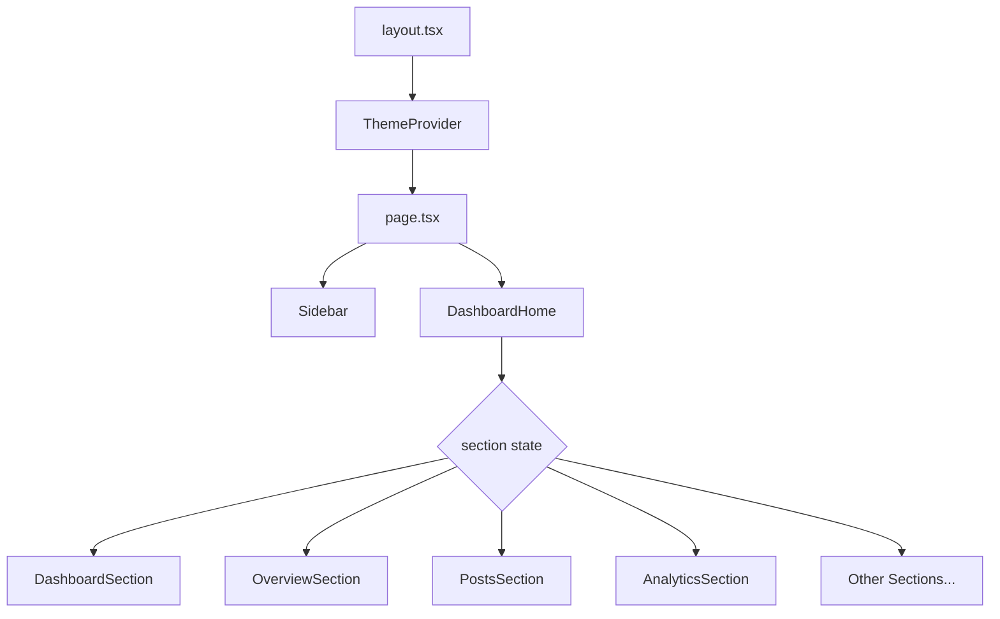

# Social Media Dashboard - Codebase Context

> **Last Updated:** February 5, 2026  
> **Purpose:** Comprehensive reference for understanding the codebase architecture, components, and development patterns.

---

## 🎯 Project Overview

A **comprehensive social media analytics platform** built with modern web technologies. Provides real-time insights, interactive data visualization, and advanced UX features for social media management.

| Aspect | Details |
|--------|---------|
| **Framework** | Next.js 15.3.3 (App Router) |
| **Frontend** | React 19.0.0 + TypeScript 5.0 |
| **Styling** | Tailwind CSS 4.0 + Custom CSS |
| **State** | Zustand + TanStack Query |
| **UI Primitives** | Radix UI + Lucide Icons |

---

## 📁 Project Structure

```
Social-Media-Dashboard/
├── src/
│   ├── app/                    # Next.js App Router
│   │   ├── layout.tsx          # Root layout with ThemeProvider
│   │   ├── page.tsx            # Main page entry (client component)
│   │   ├── globals.css         # Theme tokens + custom animations
│   │   └── favicon.ico
│   ├── components/
│   │   ├── DashboardHome.tsx   # Section router component
│   │   ├── Sidebar.tsx         # Navigation sidebar
│   │   ├── ThemeToggler.tsx    # Dark/Light mode toggle
│   │   ├── sections/           # 9 dashboard views
│   │   └── ui/                 # 9 reusable UI components
│   ├── hooks/
│   │   ├── useResponsive.ts    # Breakpoint detection
│   │   └── useAccessibility.ts # Keyboard shortcuts
│   └── lib/
│       └── utils.ts            # cn() utility for Tailwind
├── docs/                       # Documentation files
├── public/                     # Static assets
└── package.json                # Dependencies
```

---

## 🧩 Core Architecture

### Entry Points



### Page Flow

1. **`layout.tsx`** - Root layout with `next-themes` ThemeProvider, Geist fonts
2. **`page.tsx`** - Client component managing `selectedSection` state + mobile sidebar
3. **`DashboardHome.tsx`** - Switch-based router rendering appropriate section
4. **`Sidebar.tsx`** - Navigation with 9 menu items + mobile overlay

---

## 📊 Dashboard Sections

| Section | File | Lines | Description |
|---------|------|-------|-------------|
| **Dashboard** | `DashboardSection.tsx` | ~320 | Main overview with metrics |
| **Overview** | `OverviewSection.tsx` | ~775 | **Largest** - Full analytics suite |
| **Posts** | `PostsSection.tsx` | ~360 | Post management + calendar |
| **Analytics** | `AnalyticsSection.tsx` | ~310 | Detailed analytics charts |
| **Campaigns** | `CampaignsSection.tsx` | ~330 | Marketing campaigns |
| **Customers** | `CustomersSection.tsx` | ~450 | Customer demographics |
| **Engagement** | `EngagementSection.tsx` | ~40 | Engagement metrics |
| **Users** | `UsersSection.tsx` | ~75 | User management |
| **Settings** | `SettingsSection.tsx` | ~25 | App settings |

### OverviewSection Features (Flagship)
- **Profile Summary** - Animated stats with counting animation
- **Your Accounts** - Multi-platform social media accounts
- **Post Activity** - Interactive calendar heatmap
- **Anomaly Detection** - Real-time alerts & predictions
- **Post Schedule** - Timeline with color-coded events
- **Post Insights** - Performance analytics
- **Export Functionality** - JSON/CSV data export
- **Keyboard Shortcuts** - Ctrl+R, Ctrl+Shift+A, Ctrl+H

---

## 🧱 UI Components

Located in `src/components/ui/`:

| Component | Purpose |
|-----------|---------|
| `button.tsx` | CVA-based button with 6 variants |
| `card.tsx` | Card layout with Header/Title/Content/Footer |
| `toast.tsx` | Toast notification system with `useToast` hook |
| `dialog.tsx` | Radix-based modal dialogs |
| `progress.tsx` | Progress bar component |
| `badge.tsx` | Status badges |
| `loading-spinner.tsx` | Loading indicator |
| `skeleton.tsx` | Loading placeholder |
| `tooltip.tsx` | Hover tooltips |

---

## 🪝 Custom Hooks

### `useResponsive.ts`
Detects screen breakpoints for responsive design:
```typescript
const { screenSize, isMobile, isTablet, isDesktop, windowSize } = useResponsive();
// Breakpoints: xs(0), sm(640), md(768), lg(1024), xl(1280), 2xl(1536)
```

### `useAccessibility.ts`
Keyboard shortcut management:
```typescript
useKeyboardShortcuts({
  shortcuts: {
    'ctrl+r': refreshHandler,
    'ctrl+shift+a': addAccountHandler,
    'escape': closeModalHandler,
  }
});
```
Also exports `useFocusManagement()` for focus trapping in modals.

---

## 🎨 Theming System

### CSS Variables (`globals.css`)
Uses **OKLCH color space** for both light and dark themes:

```css
:root {
  --background: oklch(1 0 0);
  --foreground: oklch(0.145 0 0);
  --primary: oklch(0.205 0 0);
  --card: oklch(1 0 0);
  /* + 25 more tokens */
}

.dark {
  --background: oklch(0.145 0 0);
  --foreground: oklch(0.985 0 0);
  /* Dark variants */
}
```

### Custom Animations
- `animate-fade-in-up` - Entry animation
- `animate-slide-in-right` - Slide transition
- `animate-pulse-slow` - Subtle pulsing
- `animate-number` - Counting animation

### Responsive Utilities
- `.touch-friendly` - 44px min touch target
- `.safe-area` - iOS safe area support
- `.card-hover` - Lift effect on hover
- `.bg-overview-gradient` - Custom gradient backgrounds

---

## 🔧 Key Dependencies

| Package | Version | Purpose |
|---------|---------|---------|
| `next` | 15.3.3 | React framework |
| `react` | 19.0.0 | UI library |
| `tailwindcss` | 4.0 | CSS framework |
| `zustand` | 5.0.5 | State management |
| `@tanstack/react-query` | 5.80.6 | Server state |
| `chart.js` + `react-chartjs-2` | Latest | Data visualization |
| `lucide-react` | 0.514.0 | Icon library |
| `@radix-ui/*` | Various | Accessible primitives |
| `next-themes` | 0.4.6 | Theme switching |
| `socket.io-client` | 4.8.1 | Real-time updates |

---

## ⌨️ Keyboard Shortcuts

| Shortcut | Action |
|----------|--------|
| `Ctrl+R` | Refresh dashboard data |
| `Ctrl+Shift+A` | Open add account modal |
| `Ctrl+H` | Show help modal |
| `1` / `2` | Switch location/age tabs |
| `Escape` | Close modals |

---

## 📱 Responsive Breakpoints

| Name | Width | Use Case |
|------|-------|----------|
| `xs` | 0-320px | Small mobiles |
| `sm` | 320-640px | Standard mobiles |
| `md` | 768px+ | Tablets |
| `lg` | 1024px+ | Laptops |
| `xl` | 1280px+ | Desktops |
| `2xl` | 1536px+ | Large monitors |

---

## 🚀 Development Commands

```bash
npm run dev      # Start development server
npm run build    # Production build
npm run start    # Start production server
npm run lint     # Run ESLint
```

---

## 📂 Documentation

| File | Purpose |
|------|---------|
| [README.md](./README.md) | Project overview & setup |
| [OVERVIEW_IMPLEMENTATION.md](./OVERVIEW_IMPLEMENTATION.md) | Feature implementation summary |
| [docs/api.md](./docs/api.md) | API reference |
| [docs/components.md](./docs/components.md) | Component documentation |
| [docs/deployment.md](./docs/deployment.md) | Deployment guide |

---

## 🏗️ Architecture Patterns

### Client-Side Navigation
- Single-page app with client-side section switching
- State managed via React `useState` in main page
- No server-side routing between dashboard sections

### Component Composition
- Compound components pattern for Cards (`Card`, `CardHeader`, `CardTitle`, etc.)
- CVA (Class Variance Authority) for variant management
- Radix primitives for accessible dialogs/tooltips

### Styling Strategy
- Tailwind utilities as primary styling method
- CSS custom properties for theming
- `cn()` utility for conditional classes via `clsx` + `tailwind-merge`

---

## 🔍 Quick Reference

### File Imports
```typescript
// Components
import { Button } from "@/components/ui/button";
import { Card, CardHeader, CardContent } from "@/components/ui/card";

// Hooks
import { useResponsive } from "@/hooks/useResponsive";
import { useKeyboardShortcuts } from "@/hooks/useAccessibility";
import { useToast } from "@/components/ui/toast";

// Utils
import { cn } from "@/lib/utils";
```

### Adding New Section
1. Create `src/components/sections/NewSection.tsx`
2. Add import + case in `DashboardHome.tsx`
3. Add nav item in `Sidebar.tsx` navItems array

---

*This context file provides a complete reference for navigating and extending the Social Media Dashboard codebase.*
